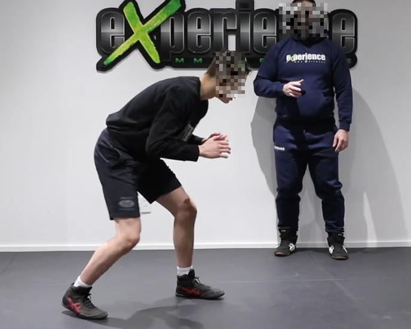
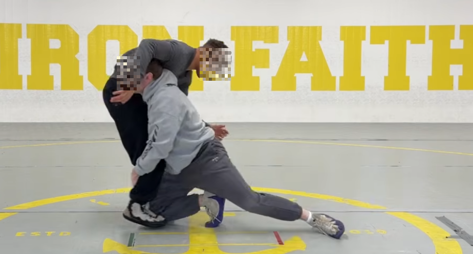
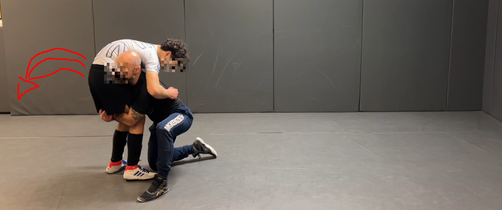

## 1 - The initial position

You must have the legs spread apart and be low. Your bust must not be too erect or too low; you must have a strong neck.

## 2 - The level change

When entering the legs, you need to be as low as possible on your center of gravity so that your knees and front ham do not have much space to rest on the ground.

## 3 - Drive

Finally, your back ham must come back to the side of your manager, which gives you a great position to send it strongly with your back toward the side of your rear leg.

